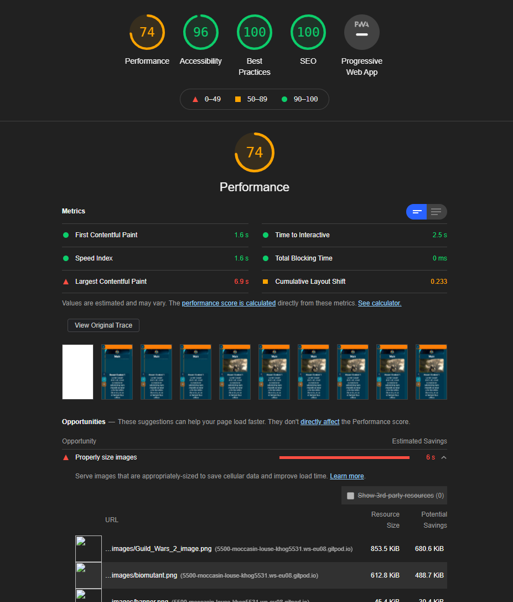

# **Sup of Gaming**
### HTML + CSS Milestone Project - Code Institute - Tadhg Nolan.

A deployed link to the website can be found here: [Live Site](https://tadhgnolan.github.io/Portfolio-Project-1/)

# Table of Contents
1. [Intro](#intro)
2. [Technologies](#technologies)
3. [Testing](#testing)
4. [Credits](#credits)
5. [Review_Process](#review_process)
6. [Deployment](#deployment)
7. [Acknowledgements](#acknowledgements)

## Intro

The owner requires a gaming review and opinion website which will also link to their YouTube channel.

The purpose is to promote video game opinions, articles, written and video reviews in an easy to interpret format. 
___
### Showcase

Initial mockup wireframe can be found [here](https://github.com/tadhgnolan/Portfolio-Project-1/blob/master/Assets/readmeassets/sup%20of%20gaming%20initial%20mockup.pdf)

### User Stories

End users will be consumers looking for opinions regarding the quality of video games which they may wish to purchase.

* As a user I would like the articles/videos to be quickly accessible with minimal presses/clicks.

* As a user I would like the stories to be readable on the go (on the bus, in a cafe etc.)

* As a user I would like to be able to access new articles first and previous stories in a clearly ordered fashion.

* As a user I would like to have access to social media links to what the creator is working on & media that interests them or is related to the sites content. 

### Features

Home/landing area - This area should be welcoming with a brand or game relevant image and direct users towards the articles (Denoted by article name and related image behind text).

Navbar - Hamburger menu for easy access on mobile devices. 

Articles - Links directly to Articles section with articles listed in chronological order.

Videos - Links directly to Videos section with videos displayed in chronological order.

Reviews - Links directly to Reviews section listing written video game reviews in chronological order.

Contact/Socials - Email form and social media links if users wish to contact or follow the content creator. 

### Existing Features

Navbar

Articles

Reviews

Videos

Contacts/Socials

Readmorereadless script to allow expandable text & reduce necessary page space for each article. Written in JavaScript. 

### Future Features

Functioning contact form. 

Working hero video

Add Bootstrap to 

### Optimisation
Used image software (G.I.M.P.) and https://tinyjpg.com/ to compress image file size.

Used Lighthouse testing to suggest further action.

Improved UX by adding smooth scrolling.

Used Adobe Color Wheel to find matching hues & avoid issues for colorblind users.

---

## Technologies

* [HTML5](https://html.spec.whatwg.org/multipage/) - Structure
* [CSS3](https://developer.mozilla.org/en-US/docs/Web/CSS)
* [JavaScript](https://www.javascript.com/)
- [Gitpod](https://www.gitpod.io/about/)
	- IDE used to write and deploy code.
---

## Testing

All testing performed before and after each commit.

Repeated real world testing performed with Google Pixel 3aXL (2160 × 1080px), Nokia 3 (720 x 1280), Asus Nexus 7 (1920 x 1200px) & Desktop PC (1920 x 1080px + 2560 × 1440) representing a mixture of age plus hardware capability & were readily available.

In Chrome Dev Tools, tested repeatedly with all available presets

This functionality testing involved:

- Verifying all navbar & other links functioned as expected.

- Using Chrome Dev Tools Elements tab to test out small styling changes before adding.

- Checking that fonts scaled correctly for each display size.

- Checking for overflow.

- Tested html & CSS at https://validator.w3.org. (srcset attribute was being used unnecessarily. Used auto as a value for padding-left property. Removed. Used xxx-large as a value for font property instead of font-size. Rectified).

- Testing with Lighthouse. Final score 74. (main issue was due to large image sizes. Unfortunately I was unable to compress images further without pixelization).

### Issues Encountered + Bugs

- Video background had useability issue due to flashing light and was removed.

- Footer text won't display properly on iPhone 5, Moto G4 & Samsung S5. Was unable to find cause.

- Unable to get readmoreless button to function with more than one `
` tag. 
    
- Some issues with border and margin alignment. All were resolved.
    
___

## Credits

---

### Code Used From Other Sites + Tutorials

https://w3collective.com/fullscreen-video-background/
    
https://www.w3docs.com/snippets/css/how-to-resize-images-proportionally-scaled-using-css-for-responsive-web-design.html
    
https://www.w3docs.com/snippets/css/how-to-horizontally-center-a-div-with-css.html
    
https://www.w3docs.com/snippets/css/how-to-resize-images-proportionally-scaled-using-css-for-responsive-web-design.html
    
https://www.w3schools.com/css/css_dropdowns.asp
    
https://www.w3schools.com/csS/css3_flexbox_responsive.asp
    
https://www.w3schools.com/howto/howto_js_read_more.asp
    
https://www.w3schools.com/howto/howto_css_sticky_social_bar.asp
    
https://code-boxx.com/simple-responsive-pure-css-hamburger-menu/
    
https://www.w3schools.com/csS/css_border.asp
    
https://www.w3schools.com/css/css3_borders.asp
    
https://www.w3schools.com/Css/css3_mediaqueries.asp
    
http://martinpennock.com/blog/force-footer-bottom-page-css/
    
https://www.w3schools.com/csS/css3_buttons.asp    

___
### References
    
https://www.designmantic.com/community/website-design-guide-color-blind.php
    
https://color.adobe.com/create/color-accessibility
    
https://www.giantbomb.com/
    
https://www.gamespot.com/
    
https://www.ign.com/ie
    
https://www.w3schools.com
    
https://stackoverflow.com
___

### Content
All images were taken by and are personally owned by me.
___   

## Review_Process
    
Review with a working developer.
    
Meetings with Mentor at start, midway and end of project, setting actions for next session. 
    
___    

## Deployment
- The site was deployed to GitHub pages. The steps to deploy are as follows: 
  - In the GitHub repository, navigate to the Settings tab 
  - From the source section drop-down menu, select the Master Branch
  - Once the master branch has been selected, the page will be automatically refreshed with a detailed ribbon display to indicate the successful deployment. 
  
- To clone to a local machine follow these steps:
  
  - On GitHub, navigate to the main page of the repository.
  - Above the list of files, click download Code.
  - To clone the repository using HTTPS, under "Clone with HTTPS", click the clipboard icon.
  - Open Git Bash.
  - Change the current working directory to the location where you want the cloned directory.
  - Type git clone, and then paste the URL you copied earlier.
    `$ git clone https://github.com/tadhgnolan/Portfolio-Project-1`
  - Press Enter to create your local clone. 
  	`$ git clone https://github.com/tadhgnolan/Portfolio-Project-1`
    ``> Cloning into `Spoon-Knife`...``
    `> remote: Counting objects: 10, done.`
    `> remote: Compressing objects: 100% (8/8), done.`
    `> remove: Total 10 (delta 1), reused 10 (delta 1)`
    `> Unpacking objects: 100% (10/10), done.`
   
  
 - The live link can be found here - https://tadhgnolan.github.io/Portfolio-Project-1/
___

## Acknowledgements
    
Huge thanks to my brother Cormac Nolan (a working developer) for much advice and feedback over many sessions and to my mentor Arnold Kyeza for his invaluable feedback at key stages throughout the project. 
    
### Created by Tadhg Nolan